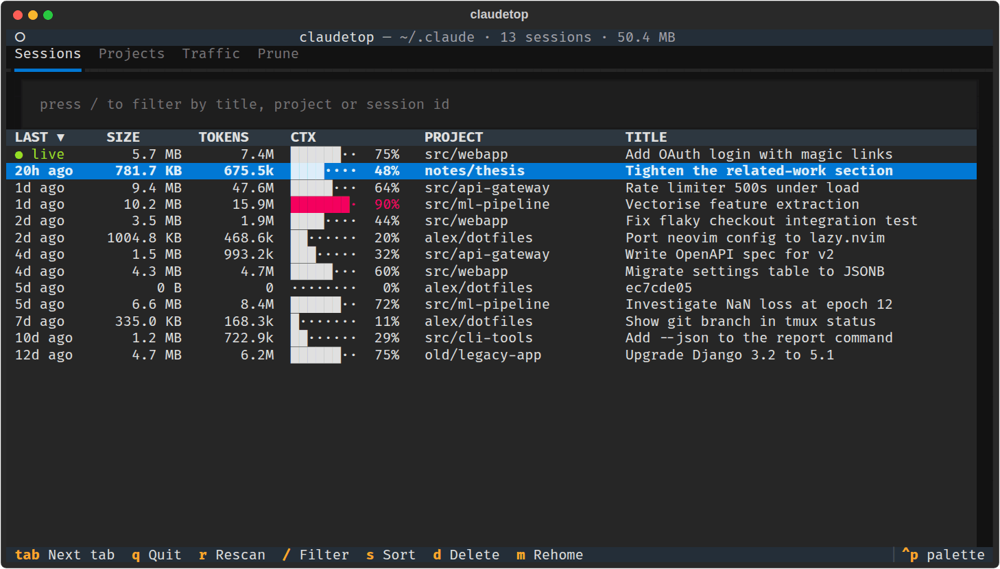
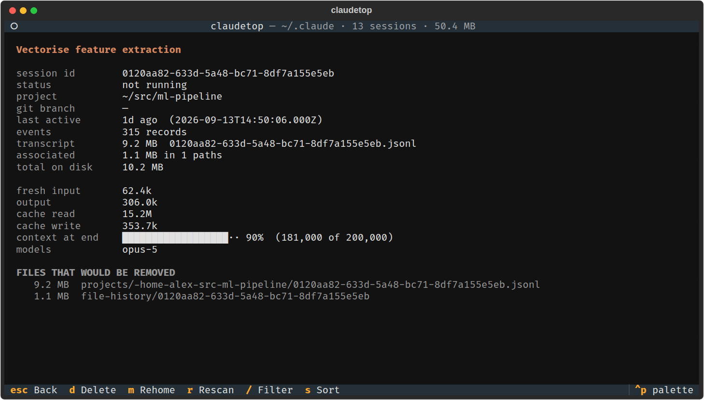
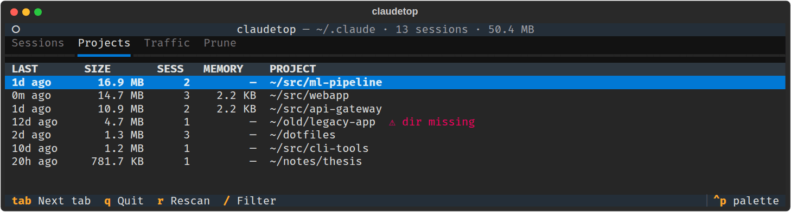
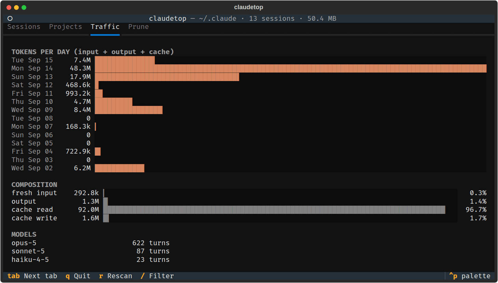
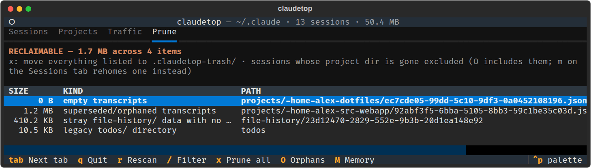

# claudetop

A terminal UI for inspecting and cleaning up Claude Code sessions on disk
(`~/.claude`, or `$CLAUDE_CONFIG_DIR`).



- See every session with its size on disk, token use, and how full its context
  window got
- Find what is taking space, and prune leftovers Claude Code no longer needs
- Delete a session and all its files, or move it to another project
- Undo mistakes: deleted files go to a trash you can restore from

Screenshots use made-up data.

## LLM Disclaimer

This tool is **almost completely** written by a large language model.

## Install

Needs Python 3.12 or newer. Tested on Linux.

```sh
uv tool install git+https://github.com/Hs293Go/claudetop
# or
pipx install git+https://github.com/Hs293Go/claudetop
```

Then run `claudetop`. From a checkout, `uv run claudetop` runs it without
installing.

## A tour

### Sessions

Every session transcript, newest first.

- **LAST**: time since the session was last written. `● live` means a Claude
  Code process has it open right now.
- **SIZE**: the transcript plus the session's other files, such as file
  history, subagent transcripts and tool results.
- **TOKENS**: input, output and cache tokens used over the session.
- **CTX**: how full the context window was on the last turn, red at 85% or
  more. Transcripts don't record the window size, so claudetop assumes 1M once
  a session has gone past 200k tokens, else 200k. `--context-window` overrides
  this.
- **PROJECT**: the last two parts of the working directory.
- **TITLE**: the title you gave the session, else Claude's generated title,
  else the opening prompt.

Sort with `s` or by clicking a column header. Filter with `/`.

### Session details



`enter` opens a session and lists every file a delete would remove. Press `d`
to delete it or `m` to rehome it.

**Rehome** moves a session to a different project directory, for example after
you renamed a repo. It moves the session's files and updates the working
directory in the transcript, so `claude --resume` opens it in the new place.
Paths inside the project keep their place: `old/src` becomes `new/src`.

### Projects



Sessions rolled up per working directory, largest first, with the size of each
project's auto-memory. Directories that no longer exist are flagged
`⚠ dir missing`. `enter` shows that project's sessions.

### Traffic



Tokens per day, split into fresh input, output, cache reads and cache writes,
plus turns per model.

### Prune



Data that is safe to remove:

- old transcript copies Claude Code set aside
- empty transcripts
- per-session data (file history, session env, debug logs) whose transcript is
  gone
- legacy directories that current Claude Code no longer writes to

Press `x` to move everything listed to the trash. Two kinds of data are left
out unless you ask for them:

- `O` includes sessions whose project directory is gone. A renamed repo or an
  unmounted drive looks the same as a deleted project, so rehoming is often the
  better fix.
- `M` then also includes those projects' auto-memory.

## Safety

- **Deletes go to a trash.** Deleting and pruning move files into
  `.claudetop-trash/` in the config dir, unless you run with `--hard`.
  `claudetop --restore latest` puts the newest batch back where it came from.
- **Typed confirmation.** Every delete and prune asks you to type `yes` or
  `prune`.
- **Live sessions are left alone.** A session Claude Code has open is never
  deleted, rehomed or pruned, even if it started after the scan. Session data
  from the last few minutes is never pruned either.
- **Rehome rolls back.** If any step fails, the files are put back where they
  were.

## Command line

```sh
claudetop                   # the TUI
claudetop --report          # plain-text summary
claudetop --json            # the whole scan as JSON
claudetop --trash           # list trash batches
claudetop --restore latest  # restore the newest batch, or pass a batch name
```

`claudetop --help` lists every option.

## Keys

Navigation is vim-style.

| Key                 | Action                                          |
| ------------------- | ----------------------------------------------- |
| `j` / `k`           | Down / up                                       |
| `gg` / `G`          | Top / bottom                                    |
| `ctrl+d` / `ctrl+u` | Half page down / up                             |
| `ctrl+f` / `ctrl+b` | Full page down / up                             |
| `h` / `l`           | Scroll left / right                             |
| `tab` / `shift+tab` | Next / previous tab (also `gt` / `gT`, `1`–`4`) |
| `/`                 | Filter sessions (`enter` leaves, `esc` clears)  |
| `enter`             | Session details; on Projects, its sessions      |
| `s`                 | Sort by last active, size, tokens or context    |
| `d`                 | Delete the selected session and its files       |
| `m`                 | Rehome the selected session                     |
| `x`                 | Prune everything on the Prune tab               |
| `O`                 | Also prune sessions whose project dir is gone   |
| `M`                 | Also prune their auto-memory                    |
| `r`                 | Rescan                                          |
| `esc`               | Close details                                   |
| `q`                 | Close details, or quit                          |

## Development

```sh
uv sync
uv run pytest
uv run ruff check && uv run ruff format --check
uv run ty check
```

## License

MIT. See [LICENSE](LICENSE).
